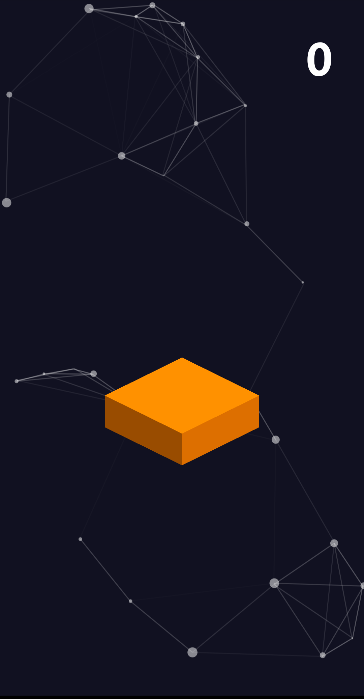
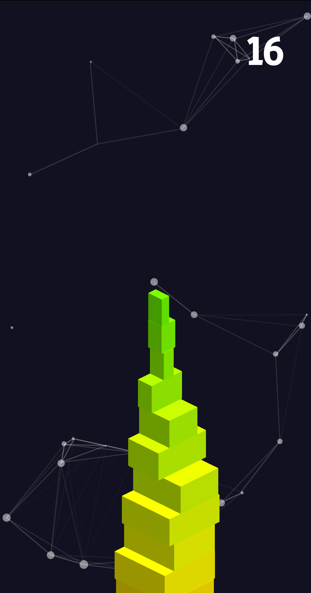
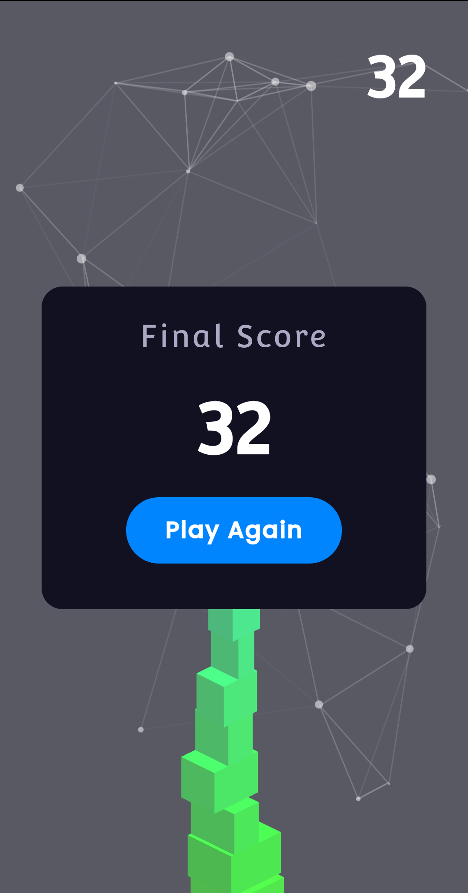
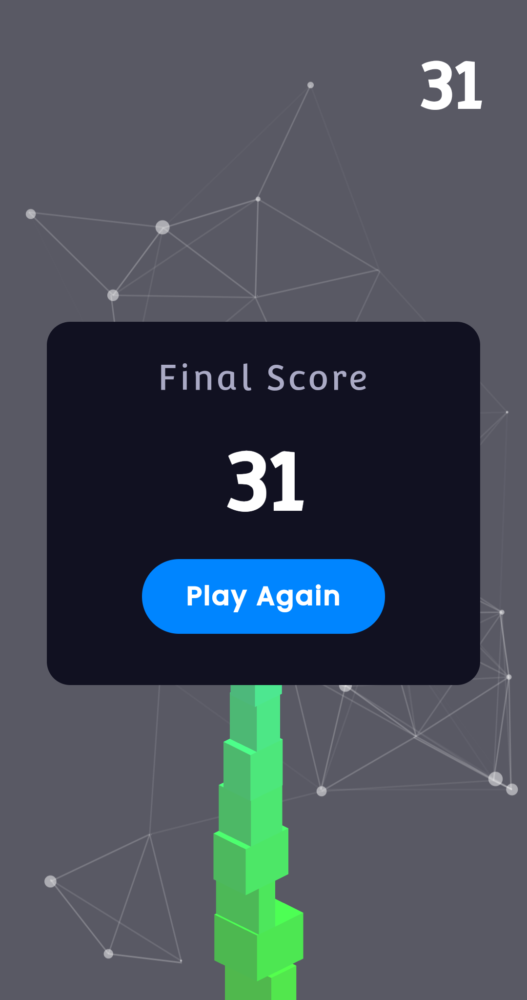

# Box Stacking Game

<h3 align="center">Hit the ⭐ button to show some ❤️ 😃</h3>

---

### Table of Contents

- [Description](#description)
- [Tech Stack](#Tech-Stack)
- [Live links](#Live-links)
- [Author Info](#Author-Info)

---

## Description

**Looking for something cool and exciting to kill your boredom? 
Open the game and simply tap on the screen when the boxes overlap to capture and stack them and get more points. That's all ! 
Now enjoy and try to achieve a great score.**

## Tech Stack

- HTML
- CSS
- JavaScript (Three.js for 3D rendering)

[Back To The Top](#Box-Stacking-Game)

---

## Live links

- Web : [Play Now](https://niloysikdar.github.io/box-stacking-game/)
- Play Store : [Download Now](https://play.google.com/store/apps/details?id=com.boxking.android)

## Author Info

- LinkedIn - [Niloy Sikdar](https://www.linkedin.com/in/niloysikdar/)
- GitHub - [Niloy Sikdar](https://github.com/niloysikdar)

[Back To The Top](#Box-Stacking-Game)